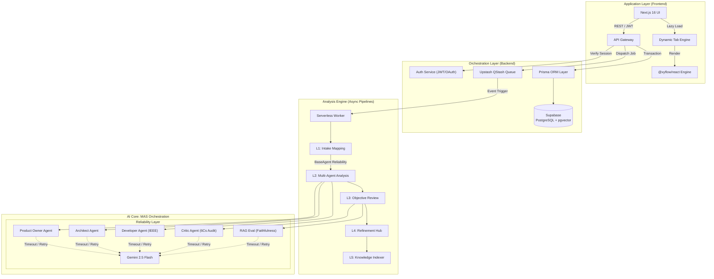

# System Architecture: SRA Platform

## 📑 Executive Overview

The **SRA (Smart Requirements Analyzer)** is engineered as a high-fidelity, decoupled multi-layer analysis pipeline. Unlike traditional one-shot AI applications, SRA treats requirements engineering as a structured manufacturing process, where raw intent is iteratively refined, validated, and formalized into IEEE-830 artifacts.

---

## 🏗️ Architectural Blueprint

The system follows a modern **Manager-Worker** pattern, utilizing serverless orchestration for high scalability and resilience.



---

## 🚀 The 5-Layer Analysis Pipeline

The core innovation of SRA is its rigid, automated pipeline that ensures requirement integrity.

### Layer 1: Strategic Intake Mapping
*   **Purpose**: Translates unstructured stakeholder vision into a standardized JSON intake model.
*   **Logic**: Uses semantic mapping to categorize input into draft IEEE sections (Scope, Perspective, etc.).

### Layer 2: Multi-Agent Analysis (MAS)
*   **Purpose**: Parallelize technical and business reasoning.
*   **Implementation**: A Multi-Agent System using the **v1.1.0 Gold Standard** prompt registry.
    *   **PO Agent**: Business value and scope refinement.
    *   **Architect Agent**: Technical stack and schema design with RAG context.
    *   **Developer Agent**: IEEE 830-1998 document synthesis.

### Layer 3: Objective Review & Benchmarking
*   **Purpose**: Automated quality assurance.
*   **Action**: 
    *   **6Cs Audit**: Scores SRS against Clarity, Completeness, Conciseness, Consistency, Correctness, and Context.
    *   **RAG Evaluation**: LLM-as-a-judge scoring of **Faithfulness** (context grounding) and **Relevancy**.

### Layer 4: Interactive Refinement Hub
*   **Purpose**: Enables "Human-in-the-loop" iterations.
*   **Features**: Intelligent patching, version branching, and "Self-Healing" diagram repair for syntax errors.

### Layer 5: Semantic Knowledge Persistence
*   **Purpose**: Enterprise-scale requirement reuse.
*   **persistence**: Shreds finalized requirements into semantic fragments and indexes them via `pgvector`.
*   **Result**: Sub-second context retrieval for project-level consistency.

---

## 💾 Data Modeling & Persistence

SRA implements a **Recursive Versioning Tree**, ensuring that every change is non-destructive and auditable.

### Entity Relationships (Prisma)
- **Project**: The top-level administrative unit (Owner, Settings, Metadata).
- **Analysis**: A single point in time for a project's requirements.
- **Hierarchical Logic**: Analyses are linked via `rootId` (original version) and `parentId` (direct predecessor), forming a visual project timeline.

---

## 🛡️ Security & Operational Integrity

### Authentication Architecture
- **JWT-First**: All API interactions are governed by signed JWT tokens.
- **Provider Abstraction**: Unified support for Google Workspace and GitHub Enterprise OAuth.
- **RLS (Row Level Security)**: Supabase-level security ensuring that even at the database layer, users can only access their authorized project fragments.

### Resilience & Observability Patterns
- **Standardized API Bridge**: All endpoints follow a unified bridge pattern: `{ success: boolean, data: any, message: string, errorCode: string }`.
- **Deep Health Probes**: Real-time monitoring via `/api/health` checking Prisma connectivity and LLM configurations.
- **Graceful Shutdown**: The server implements clean process exit logic, allowing in-flight requests to complete before releasing resources.
- **Exponential Backoff**: Used in QStash for AI service failures.
- **JWT Auth**: Secure, stateless authentication using JSON Web Tokens.
- **Unified API Bridge**: All client-side API interactions are consolidated through the `useAuthFetch` hook, which automatically manages bearer tokens for all requests.
- **Error Boundaries**: Granular React boundaries to isolate Mermaid rendering or Flowchart failures from the main UI.

---

## 🔧 AI Orchestration Strategy

The system utilizes a **Prompt Factory** pattern to maintain consistent AI outputs across multiple versions.

1.  **Unified Prompt Factory**: Uses a versioned registry (`utils/versions`) to ensure consistent persona behavior and IEEE output.
2.  **Strict JSON Schemas**: AI outputs are validated against **Zod** schemas before being committed.
3.  **Benchmark Loops**: Each analysis calculates an `industryScore` based on the 6Cs audit, enabling data-driven refinement.
4.  **AI Reliability Layer**: Implemented central timeout (360s) and retry policies in `BaseAgent` to handle network jitter and AI service rate-limits gracefully.

---

## ⚡ Scalability & Distributed Systems

SRA implements advanced engineering patterns to ensure resilience and performance at scale.

### Distributed Rate Limiting
- **Technology**: Redis (Upstash) + `rate-limit-redis`.
- **Strategy**: Distributed Sliding Window.
- **Benefit**: Rate limits are synchronized across all server instances (serverless or containerized), preventing abuse even in scaled environments.

### Caching Strategy
- **Layer**: Service-Level Caching.
- **Implementation**: Heavy read operations (e.g., User Dashboard `getUserAnalyses`) are cached in Redis with a 60-second TTL.
- **Outcome**: significantly reduces database read pressure during high-traffic periods.

### Load Balancing & Reverse Proxy
- **Local Dev**: Docker Compose runs **Nginx** on port 8080, distributing traffic across 2 Backend replicas using Round-Robin.
- **Production**: Vercel/Render Edge Networks handle global load balancing and SSL termination.

### CAP Theorem Optimization
- **Classification**: **CA** (Consistency + Availability).
- **Rationale**: Requirements engineering demands strict data consistency (ACID transactions via Prisma). Partition tolerance is managed via managed cloud infrastructure (Supabase/Upstash) which handles replication.

---

## 🗺️ Roadmap & Operational Governance

Detailed governance and contribution models are maintained in the [CONTRIBUTING.md](CONTRIBUTING.md) and [SECURITY.md](SECURITY.md) documents. For technical maintenance, refer to the [Agent Workflows](.agent/workflows/).

## 🚦 End-to-End User Journey

To understand how these components interact, let's walk through a typical requirement analysis session.

### 1. Project Initialization
- **Scenario**: A user submits a raw project description.
- **Flow**: The Frontend sends a request to the Backend, which validates the session and initializes the 5-Layer Pipeline.

### 2. Strategic Mapping (Layer 1) & Verification (Layer 2)
- **Scenario**: AI identifies ambiguities.
- **Flow**: If the Gatekeeper detects missing logic, the user receives real-time feedback. If validated, the job is queued.
- **Async Processing**: Once validated, a job is published to **Upstash QStash**, releasing the HTTP connection immediately.

### 3. Exploring Results (Layer 3)
- **Scenario**: Analyzing the generated IEEE-830 specification.
- **Architectural Flow**:
    -   **Modular Workspace Tabs**: The frontend renders the complex JSON structure into 7 specialized, memoized tab components (Introduction, Features, Interfaces, NFRs, Appendices, Code Assets, Quality Audit). These are **dynamically imported** (`next/dynamic`) to ensure sub-second initial load times by only fetching the active tab's code.
    -   **Diagram Syntax Authority**:
        -   The **MermaidRenderer** component enforces strict syntax.
        -   Users can click "View Syntax Explanation" to see the AI's justification, ensuring the diagram matches the formal specification.

### 4. Iterative Refinement (Layer 4)
- **Scenario**: Adding a missing feature via chat.
- **Architectural Flow**:
    -   **Refinement Service**: Accepts natural language modification requests.
    -   **Time Travel**: The backend creates a *new* `Analysis` version record linked to the parent.
    -   **Version Tree**: The frontend uses the `rootId` to display the entire version timeline, allowing instant switching between states.

### 5. Finalizing & Exporting (Layer 5)
- **Scenario**: Exporting the final SRS.
- **Architectural Flow**:
    -   **Knowledge Base**: "Shredder" workers break down the final JSON into vector embeddings for future retrieval (RAG).
    -   **Client-Side PDF**: The **Layer 5 Document Compiler** (`export-utils.ts`) generates the PDF entirely in the browser, ensuring scalability by offloading compute from the server.
    -   **Code Bundle**: Zips raw JSON and Markdown contracts for developer handoff.

## Deployment & Infrastructure

The entire platform is containerized for consistency across development and production environments.

### Docker Containers
- **Reverse Proxy**: Nginx container acting as Load Balancer and Gateway (Port 8080).
- **Backend Service**: Node.js container handling API requests, Auth, and AI orchestration (Scaled to 2 replicas).
- **Frontend Service**: Next.js Standalone container serving the UI.
- **Orchestration**: `docker-compose` manages the lifecycle and networking.

### External Services (Serverless/Managed)
- **Database**: Managed Supabase PostgreSQL instance (persists data outside containers).
- **Redis**: Managed Upstash instance (Distributed Rate Limiting & Dashboard Caching).
- **Queue**: Managed Upstash QStash (Asynchronous job processing).

---

## Content Delivery Network (CDN) Strategy

### Overview
SRA leverages **Vercel's global Edge Network** for optimal content delivery, caching, and performance across 300+ global locations.

### Edge Network Configuration

#### Static Assets
- **Location:** `/_next/static/*`, `/public/*`
- **Cache-Control:** `public, max-age=31536000, immutable`
- **Edge Caching:** Enabled globally with automatic purge on deployment
- **Compression:** Automatic Brotli/Gzip compression

#### Dynamic Routes
- **Location:** `/api/*`, `/app/*`
- **Cache-Control:** `private, no-cache`
- **Edge Functions:** Deployed to nearest region for minimal latency
- **Streaming:** Enabled for Server Components

### Caching Policies

| Asset Type | Cache Duration | Strategy | Invalidation |
|------------|----------------|----------|--------------|
| JavaScript bundles | 1 year | Content-hashed filenames | Automatic on deploy |
| CSS files | 1 year | Content-hashed filenames | Automatic on deploy |
| Images (Next.js) | 1 year | Optimized + cached | On-demand revalidation |
| Fonts | 1 year | Preloaded, immutable | Manual purge only |
| API responses | No cache | Dynamic, user-specific | N/A |
| HTML pages | No cache | SSR/ISR | Per-route revalidation |

### Cache Headers Implementation

Headers are configured in `frontend/next.config.ts`:
```javascript
async headers() {
  return [
    {
      source: '/_next/static/:path*',
      headers: [
        {
          key: 'Cache-Control',
          value: 'public, max-age=31536000, immutable',
        },
      ],
    },
    {
      source: '/api/:path*',
      headers: [
        {
          key: 'Cache-Control',
          value: 'private, no-cache, no-store, must-revalidate',
        },
      ],
    },
  ];
}
```

### Asset Versioning

#### Content Hashing
- Next.js automatically generates content hashes for all static assets
- Format: `[name].[contenthash].js`
- Ensures cache busting on updates without manual intervention

#### Deployment Strategy
1. Build generates new hashed assets
2. Deploy to Vercel Edge Network
3. Old assets remain accessible (no 404s during rollout)
4. Gradual rollout via Edge Network (zero-downtime)

### Cache Purge Procedures

#### Automatic Purge (On Deploy)
- Vercel automatically purges cache on new deployments
- No manual intervention required
- Gradual rollout ensures smooth transitions

#### Manual Purge (Vercel Dashboard)
1. Navigate to Deployments
2. Select deployment
3. Click "Purge Cache"

#### Emergency Purge (API)
```bash
# Purge specific deployment
curl -X DELETE "https://api.vercel.com/v1/deployments/[deployment-id]/cache" \
  -H "Authorization: Bearer $VERCEL_TOKEN"
```

### Performance Monitoring

#### Metrics Tracked
- **TTFB (Time to First Byte):** < 200ms target
- **Cache Hit Ratio:** > 95% for static assets
- **Edge Response Time:** < 50ms target
- **Origin Request Rate:** Minimized via edge caching

#### Monitoring Tools
- **Vercel Analytics:** Built-in performance tracking
- **Lighthouse CI:** Automated performance testing (`.github/workflows/lighthouse.yml`)
- **Real User Monitoring (RUM):** Via Vercel Analytics
- **Bundle Size Monitoring:** Automated via GitHub Actions

### Global Distribution

#### Edge Locations
- **Americas:** 100+ locations
- **Europe:** 100+ locations
- **Asia-Pacific:** 100+ locations
- **Latency Target:** < 100ms for 95% of users globally

#### Regional Optimization
- Static assets served from nearest edge location
- API requests routed to optimal serverless region
- Database queries optimized via connection pooling (Supabase)

