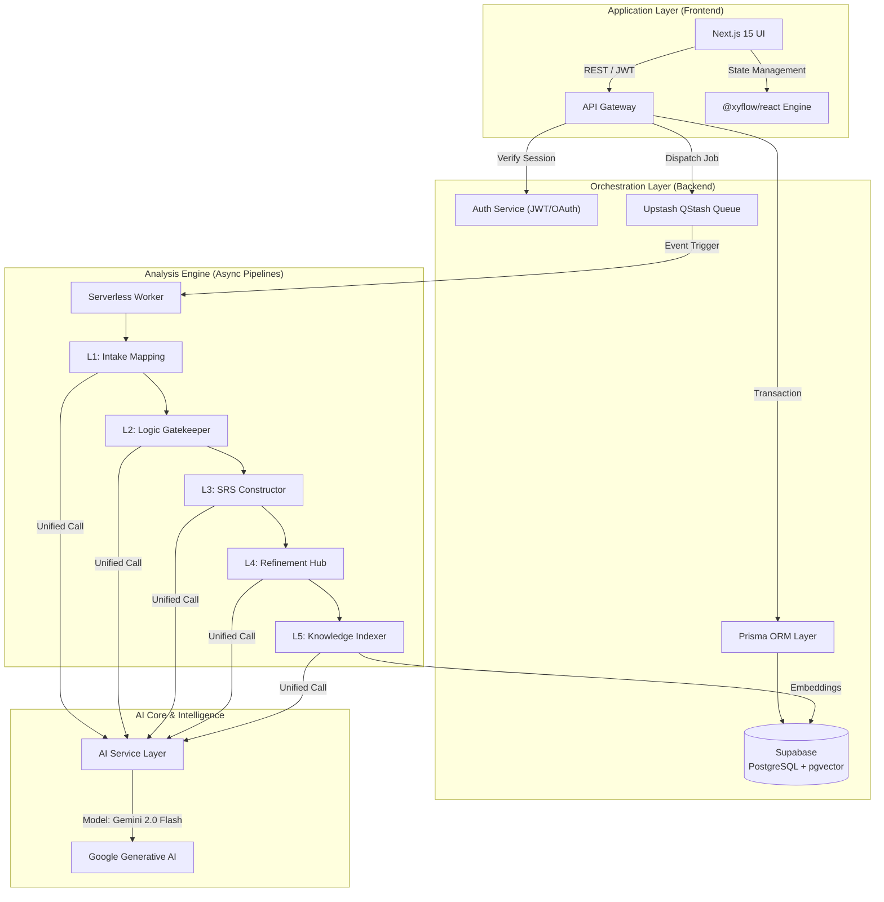

# System Architecture: SRA Platform

## 📑 Executive Overview

The **SRA (Smart Requirements Analyzer)** is engineered as a high-fidelity, decoupled multi-layer analysis pipeline. Unlike traditional one-shot AI applications, SRA treats requirements engineering as a structured manufacturing process, where raw intent is iteratively refined, validated, and formalized into IEEE-830 artifacts.

---

## 🏗️ Architectural Blueprint

The system follows a modern **Manager-Worker** pattern, utilizing serverless orchestration for high scalability and resilience.

---

## 🚀 The 5-Layer Analysis Pipeline

The core innovation of SRA is its rigid, automated pipeline that ensures requirement integrity.

### Layer 1: Strategic Intake Mapping
*   **Purpose**: Translates unstructured stakeholder vision into a standardized JSON intake model.
*   **Logic**: Uses semantic mapping to categorize input into draft IEEE sections (Scope, Perspective, etc.).

### Layer 2: Verification Gatekeeper (Quality Gate)
*   **Purpose**: Acts as an automated "Requirement Reviewer".
*   **Action**: Analyzes the intake model for ambiguity, contradictions (e.g., conflicting performance vs. safety requirements), and detail sufficiency.
*   **Outcome**: Yields a `PASS/FAIL/WARN` status. Fails trigger an interactive feedback loop for the user.

### Layer 3: High-Fidelity SRS Constructor
*   **Purpose**: The primary formalization stage.
*   **Output**: Generates full IEEE-830 compliant markdown, JIRA-ready user stories, and Mermaid.js diagrams.
*   **Technique**: Prompt-chaining with distinct personas (Architect, Business Analyst, QA Lead).

### Layer 4: Interactive Refinement Hub
*   **Purpose**: Enables "Human-in-the-loop" iterations.
*   **Features**: Intelligent patching, version branching, and "Self-Healing" diagram repair for syntax errors.

### Layer 5: Semantic Knowledge Persistence
*   **Purpose**: Enterprise-scale requirement reuse.
*   **persistence**: Shreds finalized requirements into semantic fragments and indexes them via `pgvector`.
*   **Result**: Sub-second context retrieval for project-level consistency.

---

## 💾 Data Modeling & Persistence

SRA implements a **Recursive Versioning Tree**, ensuring that every change is non-destructive and auditable.

### Entity Relationships (Prisma)
- **Project**: The top-level administrative unit (Owner, Settings, Metadata).
- **Analysis**: A single point in time for a project's requirements.
- **Hierarchical Logic**: Analyses are linked via `rootId` (original version) and `parentId` (direct predecessor), forming a visual project timeline.

---

## 🛡️ Security & Operational Integrity

### Authentication Architecture
- **JWT-First**: All API interactions are governed by signed JWT tokens.
- **Provider Abstraction**: Unified support for Google Workspace and GitHub Enterprise OAuth.
- **RLS (Row Level Security)**: Supabase-level security ensuring that even at the database layer, users can only access their authorized project fragments.

### Resilience Patterns
- **Exponential Backoff**: Used in QStash for AI service failures.
- **State Hydration**: Frontend recovery logic for long-running analyses.
- **Error Boundaries**: Granular React boundaries to isolate Mermaid rendering or Flowchart failures from the main UI.

---

## 🔧 AI Orchestration Strategy

The system utilizes a **Prompt Factory** pattern to maintain consistent AI outputs across multiple versions.

1.  **Strict JSON Schemas**: AI outputs are validated against Zod schemas before being committed to the database.
2.  **Context Injection**: Dynamic injection of project history and architectural constraints into LLM prompts.
3.  **Cost Optimization**: Leveraging Gemini 2.0 Flash for high-speed, high-context reasoning at scale.

---

## 🗺️ Roadmap & Operational Governance

Detailed governance and contribution models are maintained in the [CONTRIBUTING.md](CONTRIBUTING.md) and [SECURITY.md](SECURITY.md) documents. For technical maintenance, refer to the [Agent Workflows](.agent/workflows/).
    4.  **Async Processing**: If validated, a job is published to **Upstash QStash**, releasing the HTTP connection immediately.

### 3. Exploring Results (Layer 3)
- **Scenario**: Analyzing the generated IEEE-830 specification.
- **Architectural Flow**:
    -   **Deep Dive Tabs**: The frontend renders the complex JSON structure into readable tabs (User Stories, Diagrams).
    -   **Diagram Syntax Authority**:
        -   The **MermaidRenderer** component enforces strict syntax.
        -   Users can click "View Syntax Explanation" to see the AI's justification, ensuring the diagram matches the formal specification.

### 4. Iterative Refinement (Layer 4)
- **Scenario**: Adding a missing feature via chat.
- **Architectural Flow**:
    -   **Refinement Service**: Accepts natural language modification requests.
    -   **Time Travel**: The backend creates a *new* `Analysis` version record linked to the parent.
    -   **Version Tree**: The frontend uses the `rootId` to display the entire version timeline, allowing instant switching between states.

### 5. Finalizing & Exporting (Layer 5)
- **Scenario**: Exporting the final SRS.
- **Architectural Flow**:
    -   **Knowledge Base**: "Shredder" workers break down the final JSON into vector embeddings for future retrieval (RAG).
    -   **Client-Side PDF**: The **Layer 5 Document Compiler** (`export-utils.ts`) generates the PDF entirely in the browser, ensuring scalability by offloading compute from the server.
    -   **Code Bundle**: Zips raw JSON and Markdown contracts for developer handoff.

## Deployment & Infrastructure

The entire platform is containerized for consistency across development and production environments.

### Docker Containers
- **Backend Service**: Node.js container handling API requests, Auth, and AI orchestration.
- **Frontend Service**: Next.js Standalone container serving the UI.
- **Orchestration**: `docker-compose` manages the lifecycle and networking between these services, ensuring they can communicate securely while isolating them from the host system.

### External Services (Serverless/Managed)
- **Database**: Managed Supabase PostgreSQL instance (persists data outside containers).
- **Redis/Queue**: Managed Upstash instance (serverless job queue).

