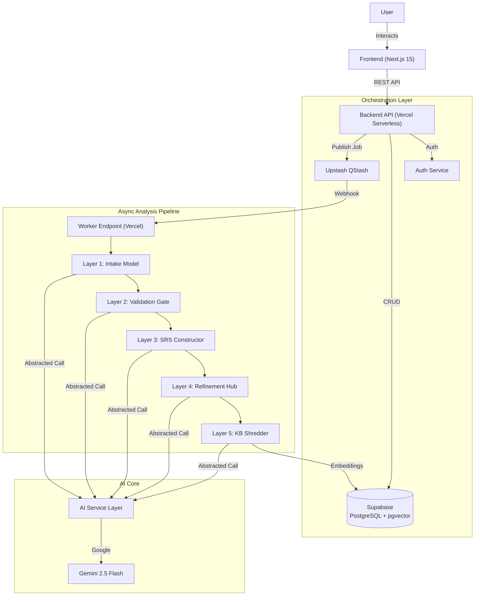
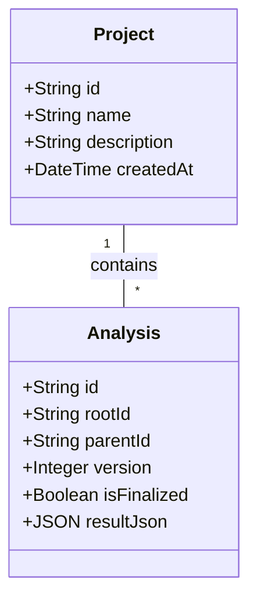

# System Architecture

## Overview

The SRA (Smart Requirements Analyst) system is a modern, event-driven ecosystem designed as a highly decoupled multi-layer pipeline. It follows a **Pipeline-as-a-Service** pattern where each layer adds increasing levels of fidelity and verification to the requirements.

## The 5-Layer Analysis Strategy

SRA moves beyond simple "prompt-and-result" patterns by treating requirement generation as a multi-step manufacturing process.

### Layer 1: Structured Intake
Converts raw, unstructured user intent into a **Standard Intake Model**. This ensures that even the most chaotic descriptions are mapped to the correct IEEE sections early in the process.

### Layer 2: Validation Gatekeeper
A critical "Quality Gate" that analyzes the Layer 1 output for ambiguity, missing context, or internal contradictions. 
- **PASS**: Proceeds to full generation.
- **FAIL**: Returns to user with specific "Clarity Requests".

### Layer 3: Final Analysis (IEEE SRS)
This layer consumes the validated intake model to generate the "Source of Truth" SRS. It synthesizes user stories, functional specs, and visual Mermaid.js models.

### Layer 4: Refinement Cycle (Chat & Patch)
Enables iterative human-in-the-loop improvements. Users talk to the AI to "nudge" specific requirements, and the system performs a non-destructive patch to the existing model, creating a new version.

### Layer 5: Knowledge Base Reuse
Finalized SRS modules are shredded into semantic chunks and stored in the **Knowledge Base**. Identical or sufficiently similar future requests are served directly from this pre-validated cache, ensuring sub-second response times.

## Versioning & Data Tree

SRA uses a **Branching Version Tree** to manage the evolution of projects.

### Entity Relationship
- **Analysis**: Each version is a standalone record linked via `rootId` and `parentId`.
- **Project**: A top-level container that tracks user ownership and metadata.

## AI Service Tier
The system implements a **Provider Abstraction** pattern. This allows the same logic (e.g., Layer 3 generation) to run on different LLMs (Gemini, GPT-4, etc.) without code changes, simply by toggling a setting in the `Analysis` metadata.

## System Capabilities & Workflow Walkthrough

This section outlines how the architecture supports the core user flows using the 5-Layer Pipeline.

### 1. Authentication Flow
- **Architecture Component**: Auth Service (NextAuth.js / OAuth Providers)
- **Flow**:
    - Users sign in via Google or GitHub.
    - JWT tokens govern session state, securing API routes.

### 2. Creating a New Analysis (Layers 1 & 2)
- **Scenario**: A user submits a raw idea (e.g., "ZombieFitness app").
- **Architectural Flow**:
    1.  **Frontend** sends the prompt to the `IntakeService`.
    2.  **Layer 1 (Intake)**: Structured data capture converts free text to JSON.
    3.  **Layer 2 (Validation)**: The AI Gatekeeper validates the prompt for clarity.
    4.  **Async Processing**: If validated, a job is published to **Upstash QStash**, releasing the HTTP connection immediately.

### 3. Exploring Results (Layer 3)
- **Scenario**: Analyzing the generated IEEE-830 specification.
- **Architectural Flow**:
    -   **Deep Dive Tabs**: The frontend renders the complex JSON structure into readable tabs (User Stories, Diagrams).
    -   **Diagram Syntax Authority**:
        -   The **MermaidRenderer** component enforces strict syntax.
        -   Users can click "View Syntax Explanation" to see the AI's justification, ensuring the diagram matches the formal specification.

### 4. Iterative Refinement (Layer 4)
- **Scenario**: Adding a missing feature via chat.
- **Architectural Flow**:
    -   **Refinement Service**: Accepts natural language modification requests.
    -   **Time Travel**: The backend creates a *new* `Analysis` version record linked to the parent.
    -   **Version Tree**: The frontend uses the `rootId` to display the entire version timeline, allowing instant switching between states.

### 5. Finalizing & Exporting (Layer 5)
- **Scenario**: Exporting the final SRS.
- **Architectural Flow**:
    -   **Knowledge Base**: "Shredder" workers break down the final JSON into vector embeddings for future retrieval (RAG).
    -   **Client-Side PDF**: The **Layer 5 Document Compiler** (`export-utils.ts`) generates the PDF entirely in the browser, ensuring scalability by offloading compute from the server.
    -   **Code Bundle**: Zips raw JSON and Markdown contracts for developer handoff.

## Deployment & Infrastructure

The entire platform is containerized for consistency across development and production environments.

### Docker Containers
- **Backend Service**: Node.js container handling API requests, Auth, and AI orchestration.
- **Frontend Service**: Next.js Standalone container serving the UI.
- **Orchestration**: `docker-compose` manages the lifecycle and networking between these services, ensuring they can communicate securely while isolating them from the host system.

### External Services (Serverless/Managed)
- **Database**: Managed Supabase PostgreSQL instance (persists data outside containers).
- **Redis/Queue**: Managed Upstash instance (serverless job queue).

