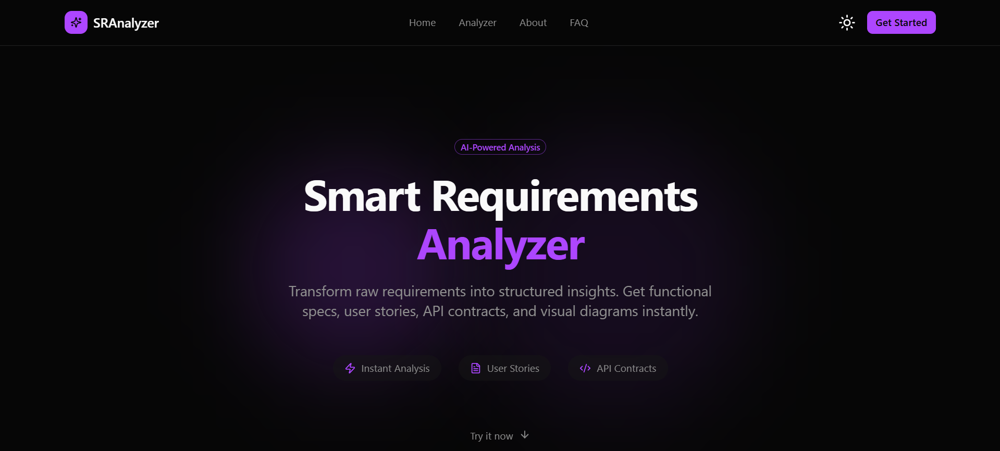

# Contributing to SRA




First off, thanks for taking the time to contribute! 🎉

The following is a set of guidelines for contributing to SRA. These are mostly guidelines, not rules. Use your best judgment, and feel free to propose changes to this document in a pull request.

## 📂 Project Structure & Navigation

Understanding the project structure is key to making effective contributions. **SRA follows a rigid 5-Layer Analysis Pipeline.**

### Backend (`/backend`)
The backend is built with **Node.js** and designed for **Vercel Serverless**, orchestrating the AI analysis layers.
-   **`src/server.js`**: The local entry point to start the server.
-   **`src/app.js`**: Express app configuration (also used by Vercel).
-   **`api/`**: Vercel Serverless Function entry points.
-   **`src/routes/`**: API route definitions.
-   **`src/controllers/`**: Logic for handling API requests.
-   **`src/services/`**: Business logic and AI integration (Layer 1-3).
-   **`src/utils/prompt_templates/`**: **CRITICAL**. Contains the system prompts for standard and strict persona validation, including the **Diagram Syntax Authority**.
-   **`src/workers/`**: Background workers for handling async tasks triggered by QStash (Layer 5 knowledge shredding).
-   **`src/middleware/`**: Middleware for auth, validation, and error handling.
-   **`.env`**: Stores environment variables like your API key and database URL. **Do not commit this file.**

### Frontend (`/frontend`)
The frontend is built with **Next.js 16 (App Router)** and **TypeScript**, styled with **Tailwind CSS v4**.
-   **`app/`**: Contains the application routes and pages.
    -   `page.tsx`: The main landing page and UI.
    -   `layout.tsx`: The root layout wrapper.
-   **`components/`**: Reusable UI components.
    -   **`ui/`**: Base components from shadcn/ui.
    -   **`analysis/tabs/`**: **NEW**. Modular sub-components for each analysis result tab.
    -   **`ResultsTabs.tsx`**: The main coordinator that imports and orchestrates the modular tabs.
    -   **`MermaidRenderer.tsx`**: **Strict** renderer for diagrams (governed by Diagram Syntax Authority).
-   **`lib/`**: Utility functions and helpers.
    -   `data.ts`: Centralized static data repository.
    -   `export-utils.ts`: **Layer 5 Document Compiler** (Frontend-only PDF generation).
-   **`public/`**: Static assets like images and icons.

## 🚀 Getting Started

### Prerequisites
Ensure you have the following installed or set up:
-   **Node.js** (v20 or higher)
-   **npm** (comes with Node.js)
-   **Supabase Project** (PostgreSQL + pgvector)
-   **Upstash Account** (Redis + QStash)
-   A **Google Gemini 2.0 Flash API Key** (Get one [here](https://aistudio.google.com/app/apikey))

### Docker Setup (Preferred)
1.  **Configure Environment**: Ensure you have `.env` files in both `backend/` and `frontend/` directories.
2.  **Run with Docker Compose**:
    ```bash
    docker-compose up --build
    ```
    This spins up both services enabling you to test the full stack immediately.

### Backend Setup (Manual)
1.  Navigate to the backend directory:
    ```bash
    cd backend
    ```
2.  Install dependencies:
    ```bash
    npm install
    ```
3.  Create a `.env` file and add the required variables (see `README.md` for the template).
4.  Initialize the database:
    ```bash
    npx prisma migrate dev --name init
    ```
5.  Start the development server:
    ```bash
    npm run dev
    ```

### Frontend Setup
1.  Open a new terminal and navigate to the frontend directory:
    ```bash
    cd frontend
    ```
2.  Install dependencies:
    ```bash
    npm install
    ```
3.  Start the development server:
    ```bash
    npm run dev
    ```
4.  Open [http://localhost:3001](http://localhost:3001) to view the app.

## 🛠️ Where to Make Changes

### Governance & Development Standards
**SRA enforces strict enterprise standards.**

#### Diagram Syntax Authority
-   **Strictness**: All diagram generation prompts in `src/utils/prompt_templates/` must adhere to strict Mermaid syntax limits.
-   **Verification**: Always verify changes using the "View Syntax Explanation" feature in the frontend.

#### Name Governance
-   **Consistency**: Ensure consistent naming across the "Introduction" section of the SRS.
-   **Semantic Anchor**: Respect the "Introduction as Semantic Anchor" rule when modifying validation logic.

### Adding New Features
-   **Backend Logic**:
    -   Add new routes in `src/routes/`.
    -   Implement logic in `src/controllers/` and `src/services/`.
    -   **Layer 4 (Refinement)** is implemented via `refinementService` in the backend.
    -   **Layer 5 (Document Compiler)** is pure client-side logic in `frontend/lib/export-utils.ts`. **Do not shift this to the backend.**
-   **Frontend UI**:
    -   To add a new section to the results, create a new component in `frontend/components/analysis/tabs/` and register it in `ResultsTabs.tsx`.
    -   **API Requests**: Use the `useAuthFetch` hook found in `lib/hooks.ts` for all authenticated requests. This hook handles CSRF and bearer tokens automatically.
    -   To change the input form, check `frontend/app/home-client.tsx`.

### Styling
-   We use **Tailwind CSS v4**. You can apply utility classes directly to your JSX elements.
-   For complex components, check `frontend/components/ui` to see if a pre-built component (like a Button or Card) already exists (shadcn/ui).

## 🔄 Contribution Workflow

1.  **Fork the repository** on GitHub.
2.  **Clone your fork** locally:
    ```bash
    git clone https://github.com/your-username/SRA.git
    cd SRA
    ```
3.  **Create a branch** for your feature or fix:
    ```bash
    git checkout -b feature/amazing-new-feature
    ```
4.  **Make your changes**. Follow the **Governance & Development Standards**.
5.  **Commit your changes** using **Conventional Commits**:
    -   `feat: add new analysis layer`
    -   `fix: resolve mermaid rendering error`
    -   `docs: update contributing guidelines`
    -   `chore: update dependencies`
    ```bash
    git commit -m "feat: add amazing new feature to results display"
    ```
6.  **Push to your fork**:
    ```bash
    git push origin feature/amazing-new-feature
    ```
7.  **Open a Pull Request** on the original repository.
8.  **Wait for Status Checks**: Ensure your PR adheres to the rules defined in [GOVERNANCE.md](GOVERNANCE.md).

## 🐛 Reporting Issues

If you find a bug or have a feature request, please open an issue on GitHub. Be sure to include:
-   Steps to reproduce the bug.
-   Expected behavior vs. actual behavior.
-   Screenshots (if applicable).

Happy Coding! 🚀
