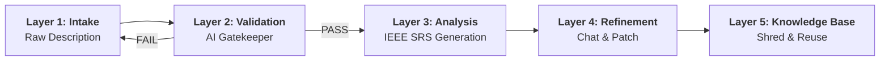

# SRA (Smart Requirements Analyzer)


**SRA** is an intelligent, AI-powered ecosystem designed to automate and professionalize the software requirements engineering process. By leveraging a multi-layer analysis pipeline, it transforms raw project visions into high-fidelity IEEE-830 artifacts.

## Why This Exists?

Requirements engineering is often the bottleneck in software development. Ambiguous requirements lead to expensive rework. SRA solves this by:
1.  **Standardizing Input**: Forcing unstructured ideas into structured models.
2.  **Validating Logic**: catching contradictions before a single line of code is written.
3.  **Automating Documentation**: Generating professional artifacts that would take humans hours to write.

## 🚀 The 5-Stage Analysis Pipeline

SRA follows a rigid, automated pipeline to ensure requirement quality and architectural consistency.



### 1. **Structured Intake** (Layer 1)
Translates free-text descriptions into an initial structured JSON model mapping to IEEE SRS sections.

### 2. **Validation Gatekeeper** (Layer 2)
An AI logic-check that ensures input is clear, consistent, and has sufficient detail before proceeding to heavy analysis.

### 3. **Final Analysis & SRS Generation** (Layer 3)
Generates the full SRS document, including User Stories, Acceptance Criteria, and UML/Mermaid diagrams.

### 4. **Iterative Refinement** (Layer 4)
Real-time chat interface to tweak requirements, automatically creating new versions and diffs.

### 5. **Knowledge Base Reuse** (Layer 5)
Finalized requirements are shredded into the Knowledge Base, allowing for optimized sub-second responses on recurring project patterns.

## ✨ Core Features

### 📊 Professional Analysis
-   **IEEE-830 Compliance**: Generates standardized sections from Introduction to Appendices.
-   **User Story Generator**: Standardized "As a... I want to... So that..." format.
-   **Acceptance Criteria**: Fine-grained success metrics for every feature.
-   **Entity Mapping**: Automated identification of data models.

### 🎨 Visual Modeling
-   **System Diagrams**: Automated generation of Sequence and Flowchart diagrams using Mermaid.js.
-   **Interactive Workspace**: Edit requirements in-place with real-time preview.

### 📦 Export & Portability
-   **Standardized PDF**: Professional export with Table of Contents and Revision History.
-   **Project Bundle**: Download zip containing diagrams, API docs, and raw JSON data.
-   **API Blueprint**: AI-generated Markdown contract for frontend/backend development.

### 🔒 Enterprise Ready
-   **Smart Versioning**: Branching and merging logic for requirements evolution.
-   **RBAC & Security**: Secure JWT authentication with Google/GitHub OAuth support.
-   **Background Queues**: Redis-backed asynchronous processing for complex AI tasks.

## 🛠️ Tech Stack

### Frontend
-   **Core**: [Next.js 15](https://nextjs.org/) (App Router), TypeScript.
-   **Styling**: [Tailwind CSS v4](https://tailwindcss.com/), Radix UI.
-   **Visualization**: [Mermaid.js](https://mermaid.js.org/).

### Backend
-   **Runtime**: [Node.js](https://nodejs.org/) (Deployed to Vercel Serverless).
-   **Data**: [PostgreSQL](https://www.postgresql.org/) + [Prisma ORM](https://www.prisma.io/) (Supabase).
-   **Vector DB**: [pgvector](https://github.com/pgvector/pgvector) for Retrieval Augmented Generation (RAG).
-   **Async**: [Upstash QStash](https://upstash.com/docs/qstash/overall/getstarted) for Serverless Job Queues.
-   **AI**: [Google Gemini 2.5 Flash](https://ai.google.dev/).

## 🏁 Getting Started

Follow these steps to set up the project locally.

### Prerequisites
-   Node.js (v18 or higher)
-   npm or yarn
-   A Google Gemini API Key
-   Supabase Project (PostgreSQL + pgvector)
-   Upstash Account (Redis + QStash)

### 1. Backend Setup

Navigate to the backend directory and install dependencies:

```bash
cd backend
npm install
```

Create a `.env` file in the `backend` directory.

#### Environment Variables

| Variable | Description |
|----------|-------------|
| **Server** | |
| `NODE_ENV` | Environment mode (development/production) |
| `PORT` | Server port (default: 3000) |
| `FRONTEND_URL` | URL of the frontend application |
| `ANALYZER_URL` | Internal URL for analysis (default: http://localhost:3000/internal/analyze) |
| **Database** | |
| `DATABASE_URL` | Prisma connection string with pooling |
| `DIRECT_URL` | Direct database connection string for migrations |
| **Auth** | |
| `JWT_SECRET` | Secret key for signing JWT tokens |
| `COOKIE_SECRET` | Secret key for signing cookies |
| `GOOGLE_CLIENT_ID` | OAuth Client ID for Google |
| `GOOGLE_CLIENT_SECRET` | OAuth Client Secret for Google |
| `GOOGLE_REDIRECT_URI` | Callback URI for Google OAuth |
| `GITHUB_CLIENT_ID` | OAuth Client ID for GitHub |
| `GITHUB_CLIENT_SECRET` | OAuth Client Secret for GitHub |
| `GITHUB_CALLBACK_URL` | Callback URL for GitHub OAuth |
| **AI & Async** | |
| `GEMINI_API_KEY` | Your Google Gemini API Key |
| `QSTASH_URL` | Upstash QStash Publish URL |
| `QSTASH_TOKEN` | Upstash QStash Token |
| `QSTASH_CURRENT_SIGNING_KEY` | Current signing key for webhooks |
| `QSTASH_NEXT_SIGNING_KEY` | Next signing key for webhooks |

Initialize the database:

```bash
npx prisma migrate dev --name init
```

Start the backend server:

```bash
npm run dev
```
The server will start on `http://localhost:3000`.

### 2. Frontend Setup

Open a new terminal, navigate to the frontend directory, and install dependencies:

```bash
cd frontend
npm install
```

Start the Next.js development server:

```bash
npm run dev
```

Open [http://localhost:3001](http://localhost:3001) to view the application.

## 📂 Project Structure

```
SRA/
├── backend/                # Server & API (See backend/README.md)
│   ├── prisma/
│   │   └── schema.prisma   # PostgreSQL database schema
│   ├── src/
│   │   ├── config/         # App configuration & OAuth
│   │   ├── controllers/    # API Request handlers
│   │   ├── services/       # AI (Gemini), Queue (Bull), & business logic
│   │   └── workers/        # Background workers for analysis
│   └── .env
│
├── frontend/               # Next.js App (See frontend/README.md)
│   ├── app/                # App Router pages
│   ├── components/         # React Components
│   └── .env.local
│
└── README.md
```

## 🧠 What I Learned

Building SRA was a deep dive into modern full-stack architecture. Key takeaways:
-   **Orchestrating AI**: Managing long-running AI tasks requires robust async queues (Upstash) rather than simple request-response cycles.
-   **Structured Outputs**: Getting LLMs to output strictly valid JSON for downstream systems is an art of prompt engineering and schema validation.
-   **State Management**: Synchronizing a complex multi-tab workspace with server state taught me the value of immutable state patterns in React.

## 🗺️ Roadmap

- [x] **Social Login**: Google & GitHub OAuth.
- [x] **History**: Save and view past analyses.
- [x] **Security**: Rate limiting and payload validation.
- [x] **Export Options**: Export requirements to PDF, CSV, or Jira.
- [ ] **Custom Prompts**: Allow users to tweak the AI system prompt.
- [ ] **Dark Mode**: Full dark mode support for the UI (Partially implemented).

## 🤝 Contributing

Contributions are welcome! Please feel free to submit a Pull Request.

## 📄 License

This project is licensed under the Apache License - see the [LICENSE](LICENSE) file for details.
