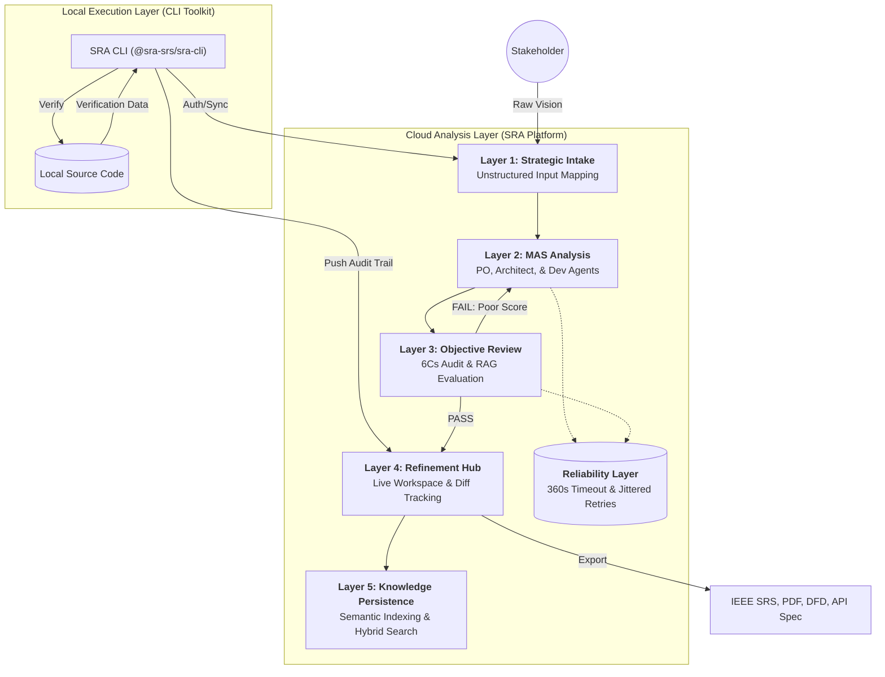

# SRA (Smart Requirements Analyzer)

[](https://github.com/Aniket-a14/SRA/actions/workflows/backend.yml)
[](https://github.com/Aniket-a14/SRA/actions/workflows/frontend.yml)
[](https://github.com/Aniket-a14/SRA/actions/workflows/lint.yml)
[](https://github.com/Aniket-a14/SRA/actions/workflows/docker-publish.yml)
[](https://github.com/Aniket-a14/SRA/actions/workflows/codeql.yml)
[](https://github.com/Aniket-a14/SRA/actions/workflows/security-audit.yml)
[](https://github.com/Aniket-a14/SRA/actions/workflows/automated-backup.yml)
[](https://github.com/Aniket-a14/SRA/actions/workflows/openapi-lint.yml)
[](https://github.com/Aniket-a14/SRA/actions/workflows/lighthouse.yml)
[](https://github.com/Aniket-a14/SRA/actions/workflows/bundle-size.yml)
[](https://github.com/Aniket-a14/SRA/actions/workflows/health-check.yml)
[](https://ieeexplore.ieee.org/document/720577)
[](https://github.com/Aniket-a14/SRA/blob/main/.github/dependabot.yml)
[](https://github.com/Aniket-a14/SRA/graphs/commit-activity)
[](https://sra-xi.vercel.app/)
[](https://badge.socket.dev/npm/package/@sra-srs/sra-cli/4.0.3)

**SRA** is an enterprise-grade, AI-orchestrated ecosystem designed to formalize the software requirements engineering lifecycle. By combining Large Language Model (LLM) reasoning with rigorous architectural standards, SRA transforms fragmented project visions into high-fidelity, production-ready technical specifications (IEEE-830).

---

## 🔗 Quick Links

| Resource | URL | Description |
|----------|-----|-------------|
| **Live Application** | [sra-xi.vercel.app](https://sra-xi.vercel.app/) | Production frontend deployment |
| **Architecture Guide** | [ARCHITECTURE.md](./ARCHITECTURE.md) | System architecture & design |
| **Operations Manual** | [OPERATIONS.md](./docs/operations/OPERATIONS.md) | Deployment, backup & DR procedures |
| **Contributing** | [CONTRIBUTING.md](./CONTRIBUTING.md) | Development setup & guidelines |

---

## 🏛️ Summary

Industry research, including PMI and other studies, indicates that a significant portion of project failures, often estimated between **30% and 50%**, can be traced back to poor requirements engineering, including unclear documentation, semantic ambiguity, and stakeholder misalignment. **SRA** mitigates this risk by providing an automated, multi-layered validation and synthesis engine.

### Core Value Propositions
*   **Zero-Ambiguity Intake**: Standardizes raw stakeholder descriptions into structured architectural models.
*   **AI-Driven Governance**: Real-time logic checking to identify contradictions, missing logic, and technical gaps.
*   **High-Fidelity Visuals**: Automated generation of multi-level Data Flow Diagrams (DFD) and system-level Mermaid diagrams.
*   **Semantic Intelligence**: Leverages vector-based knowledge retrieval (RAG) and **Graph-Hybrid Search** to ensure consistency across complex project portfolios.
*   **Intelligent Requirement Recycling**: Proactively suggests high-quality requirement fragments from past "Gold Standard" projects to accelerate new SRS drafting.
*   **Objective Quality Auditing**: Real-time scoring against the **6Cs of Requirements Quality** (Clarity, Completeness, etc.).
*   **Industry Benchmarking**: Integrated RAG evaluation for **Faithfulness** and **Answer Relevancy**.

---

## 🔄 The 5-Layer Analysis Pipeline

SRA operates on a proprietary 5-layer pipeline that ensures every requirement is processed through a rigid quality-control sequence.


```mermaid
graph TD
    subgraph "Cloud Analysis Layer (SRA Platform)"
        L1[<b>Layer 1: Strategic Intake</b><br/>Unstructured Input Mapping]
        L2[<b>Layer 2: MAS Analysis</b><br/>PO, Architect, & Dev Agents]
        L3[<b>Layer 3: Objective Review</b><br/>6Cs Audit & RAG Evaluation]
        L4[<b>Layer 4: Refinement Hub</b><br/>Live Workspace & Diff Tracking]
        L5[<b>Layer 5: Knowledge Persistence</b><br/>Semantic Indexing & Hybrid Search]
        
        Reliability[(<b>Reliability Layer</b><br/>360s Timeout & Jittered Retries)]
        L2 & L3 -.-> Reliability
    end

    subgraph "Local Execution Layer (CLI Toolkit)"
        CLI["SRA CLI (@sra-srs/sra-cli)"] -->|Auth/Sync| L1
        CLI -->|Verify| Code[(Local Source Code)]
        Code -->|Verification Data| CLI
        CLI -->|Push Audit Trail| L4
    end

    Stakeholder((Stakeholder)) -->|Raw Vision| L1
    L1 --> L2
    L2 --> L3
    L3 -->|FAIL: Poor Score| L2
    L3 -->|PASS| L4
    L4 -->|Export| Artifacts[IEEE SRS, PDF, DFD, API Spec]
    L4 --> L5
```

<details>
<summary><strong>📐 Click to Expand Layer Details</strong></summary>

1.  **Strategic Intake**: Translates free-text into a mapped JSON model aligned with IEEE section hierarchies.
2.  **Multi-Agent Analysis**: Orchestrates specialized AI agents (Product Owner, Architect, Developer) using the **v1.1.0 Gold Standard** prompt registry.
3.  **Objective Review**: Automated auditing of SRS content against the 6Cs and RAG evaluation for contextual faithfulness.
4.  **Iterative Refinement**: A modular Workspace UI for manual adjustments, version branching, and intelligent diagram repair.
5.  **Knowledge Persistence**: Finalized requirements are "shredded" and indexed into a **PostgreSQL + pgvector** graph for cross-project intelligence.

</details>

---

## ✨ Enterprise Feature Modules

### 📊 Professional Requirements Engineering
*   **IEEE-830 v2.1.0 Compliance**: Automated generation with strict identifier governance and academic prose discipline.
*   **6Cs Quality Audit**: Automated scoring for Clarity, Completeness, Conciseness, Consistency, Correctness, and Context.
*   **RAG Benchmarking**: Real-time evaluation of LLM Faithfulness and Answer Relevancy.
*   **User Story Evolution**: Generates "Jira-Ready" user stories with granular acceptance criteria.

### 🎨 Advanced Architectural Visualization
*   **Multi-Level DFDs**: Generates Level 0 (Context) and Level 1 (Functional Decomposition) Gane-Sarson diagrams.
-   **Interactive Explorer**: Powered by `@xyflow/react` with support for high-fidelity **PNG Export**.
*   **Self-Healing Diagrams**: Integrated **Mermaid Repair Engine** that identifies and fixes syntax errors in generated UML.

### 🔒 Security, Privacy & Governance
*   **Proactive PII Redaction**: Automated sanitization of user intent (Emails, Phone, CC) before processing by external AI providers.
*   **RBAC Architecture**: Secure access control with JWT integration and social OAuth (Google/GitHub).
*   **Revision History**: Complete versioning system with visual diff tracking between requirement updates.
*   **Audit-Ready Exports**: One-click professional PDF generation with table of contents and revision logs.

### 🛠️ SRA CLI Toolkit (v4.0)
*   **Spec-to-Code Traceability**: Direct link between cloud requirements and local source code implementations.
*   **Local Compliance Engine**: Run `sra check` locally to verify that your code matches the official specification.
*   **Automated Sync**: One-command synchronization of requirements into your developer workspace.
*   **System Diagnostics**: Professional `sra doctor` utility for environment validation and connectivity troubleshooting.
*   **Reverse Engineering**: Beta support for generating requirements directly from existing codebases.

---

## 🛡️ Production Hardening

SRA is engineered for stability, security, and enterprise-grade performance.

### 🧩 Infrastructure Security
- **Multi-Stage Docker Builds**: Minimized production images using separate build/runtime environments.
- **Non-Root Execution**: Containers run as unprivileged users (`nodejs`/`nextjs`) to mitigate security risks.
- **Dependency Pinning**: Strict versioning of core dependencies (e.g., Next.js 16.1.6) to ensure environment parity.

### 🌐 Network & Content Security
- **Hardened CSP**: Strict Content Security Policy injected via Next.js and Express security headers.
- **HSTS & Frame Protection**: Production-grade `Strict-Transport-Security` and `X-Frame-Options` (DENY/SAMEORIGIN) enforcement.
- **Secure Session Management**: JWT-based authentication with secure cookie handling.
- **Privacy Sanitization**: Integrated `sanitizer.js` layer to prevent data leakage to LLM providers.
- **Distributed Rate Limiting**: Redis-backed throttling ensures global protection across all server instances.

### 🔍 AI Reliability & Performance optimization
- **AI Reliability Layer**: Implemented a standardized `BaseAgent` with a 6-minute timeout, jittered retries, and high-fidelity JSON parsing logs for stable long-form document generation.
- **Frontend Code Splitting**: Transitioned to an "Archive-First" dynamic loading strategy using `next/dynamic`. Components like `ResultsTabs` and their individual sub-tabs are lazy-loaded to minimize initial JS payload and improve TBT.
- **Redis Caching**: High-traffic endpoints (Dashboard) cached via Upstash for sub-millisecond retrieval.
- **Automated SEO**: Dynamic `sitemap.xml` and `robots.txt` generation for search engine discoverability.
- **Graceful Shutdown**: Native handling of `SIGTERM`/`SIGINT` to ensure zero-downtime deployments.
- **Standalone Mode**: Next.js optimized standalone output.
- **Smart Data Fetching**: SWR-based caching and background revalidation.

### 🔐 Backup & Disaster Recovery
- **Automated Encrypted Backups**: Weekly automated database backups with AES-256-GCM encryption.
- **Point-in-Time Recovery**: 7-day PITR via Supabase for granular data restoration.
- **CLI Backup Management**: Command-line tools for manual backup creation, restoration, and verification.
- **Multi-Location Storage**: Backups stored locally, in GitHub Artifacts, and Supabase snapshots.
- **Integrity Verification**: SHA-256 checksums ensure backup file integrity.

### �️ Security Monitoring & Audit
- **Comprehensive Audit Logging**: Tracks all sensitive operations (create, delete, export) with full metadata.
- **Threat Detection**: Real-time monitoring for brute force attempts, mass deletions, and unusual access patterns.
- **Field-Level Encryption**: PII data encrypted at rest using AES-256-GCM.
- **Daily Security Audits**: Automated dependency scanning, secret leak detection, and security header validation.
- **Compliance Ready**: Audit trails and security reports for regulatory compliance.

---

## 🚀 CI/CD & Monitoring

SRA leverages professional GitHub Actions for continuous quality assurance and operational excellence.

### 🔄 Continuous Integration & Delivery
- **Automated Docker Builds**: Multi-stage Docker builds triggered on every push to `main`, publishing optimized images to GHCR.
- **Bundle Size Monitoring**: Tracks and reports JavaScript bundle size changes for the Next.js frontend, preventing performance regressions.
- **Linting & Formatting**: Enforces consistent code style and catches potential errors early in the development cycle.

### 🩺 Health & Security Monitoring
- **Scheduled Health Checks**: Hourly automated uptime verification of the entire SRA pipeline.
- **Real-time Observability**: Dedicated `/api/health` endpoint for deep system diagnostics (DB, AI Provider).
- **Docker Healthchecks**: Infrastructure-aware readiness probes ensure the frontend only serves traffic once the backend is fully initialized.
- **CodeQL Security Scans**: Proactive identification of security vulnerabilities and common coding errors.
- **Dependency Vulnerability Checks**: Scans for known vulnerabilities in project dependencies.
- **Automated Backup Verification**: Weekly encrypted database backups with integrity validation.
- **Daily Security Audits**: Comprehensive security posture checks including secret leak detection and permission audits.

---

## 💻 Tech Stack & Rationale

<details>
<summary><strong>🛠️ Click to Expand</strong></summary>

| Component | Technology | Rationale |
|-----------|------------|-----------|
| **Frontend** | [Next.js 16.1.6](https://nextjs.org/) | App Router with standalone output for enterprise scalability. |
| **Styling** | [Tailwind CSS v4](https://tailwindcss.com/) | Next-gen JIT engine for high-performance, responsive UI. |
| **Backend** | [Node.js 20](https://nodejs.org/) / [Prisma 7](https://www.prisma.io/) | Type-safe ORM for robust asynchronous data orchestration. |
| **Database** | [PostgreSQL 16+](https://www.postgresql.org/) | High-concurrency persistence with `pgvector` RAG support. |
| **Orchestration** | [Upstash QStash](https://upstash.com/) | Serverless job queue for reliable, long-running AI tasks. |
| **LLM Engine** | [Gemini 2.5 Flash](https://ai.google.dev/) | Advanced reasoning and context window for complex architectural mapping. |

</details>

---

## 🏗️ Infrastructure as Code

SRA uses **Terraform** to manage cloud infrastructure declaratively, ensuring reproducibility, disaster recovery, and version-controlled infrastructure changes.

<details>
<summary><strong>🛠️ Click to Expand Terraform Details</strong></summary>

### Infrastructure Management

All infrastructure configuration is defined in the `terraform/` directory:

```bash
terraform/
├── main.tf                    # Provider & backend configuration
├── variables.tf               # Variable definitions
├── vercel.tf                  # Vercel project resources
├── outputs.tf                 # Output values
├── terraform.tfvars.example   # Configuration template
└── README.md                  # Detailed usage guide
```

### Managed Resources

Terraform manages the following infrastructure:
- ✅ **Vercel Projects**: Monorepo with frontend (`sra`) and backend (`sra-backend`)
- ✅ **Build Configuration**: Build/install commands and framework settings
- ✅ **Git Integration**: Repository connections and deployment triggers

**Note:** Environment variables are managed directly in Vercel dashboard to avoid storing secrets in Terraform state.

### Quick Start

```bash
# Navigate to terraform directory
cd terraform

# Initialize Terraform
terraform init

# Preview infrastructure changes
terraform plan

# Apply changes (when ready)
terraform apply
```

### Benefits

- 🔄 **Version Control**: Infrastructure changes tracked in git
- 🛡️ **Disaster Recovery**: Rebuild entire infrastructure with one command
- 📝 **Documentation**: Infrastructure is self-documenting code
- 🔍 **Audit Trail**: Complete history of infrastructure changes
- 🤝 **Collaboration**: Team members can propose infrastructure changes via PRs

For detailed Terraform usage, see [`terraform/README.md`](./terraform/README.md).

</details>

---

## ⚙️ Operational Guide & Deployment

<details>
<summary><strong>�️ Click to Expand Environment & Deployment</strong></summary>

### 1. Advanced Environment Configuration

Ensure the following variables are defined in your infrastructure (see `.env.example` files in `backend/` and `frontend/` for details):

| Group | Key | Required | Description |
|-------|-----|:--------:|-------------|
| **Database** | `DATABASE_URL` | Yes | Postgres connection string with pooling. |
| **Database** | `DIRECT_URL` | Yes | Direct connection string for Prisma migrations. |
| **Database** | `REDIS_URL` | Optional | Redis connection string for rate limiting/caching. |
| **AI (Gemini)** | `GEMINI_API_KEY` | Yes | API key for Google Gemini 2.5 Flash (Primary). |
| **AI (OpenAI)**| `OPENAI_API_KEY` | Optional | API key for OpenAI (Secondary/Internal). |
| **Async** | `QSTASH_TOKEN` | Yes | Bearer token for Upstash QStash job publishing. |
| **Async** | `QSTASH_SIGNING_KEYS` | Yes | Signing keys for verifying QStash webhooks. |
| **Auth** | `JWT_SECRET` | Yes | Secret key for signing authorization tokens. |
| **Auth** | `COOKIE_SECRET` | Yes | Secret key for signed cookies. |
| **Security** | `JWT_SECRET` | Yes | Secret key for JWT signing. |
| **Backup** | `BACKUP_ENCRYPTION_KEY` | Yes | AES-256 key for encrypting database backups. |
| **Backup** | `ENCRYPTION_KEY` | Yes | Master key for field-level data encryption. |
| **Backup** | `ENCRYPTION_SALT` | Yes | Unique salt string for field-level encryption. |
| **Backup** | `BACKUP_ENCRYPTION_SALT` | Yes | Unique salt string for backup encryption. |
| **Backup** | `BACKUP_DIR` | Optional | Directory for backup storage (default: `./backups`). |
| **Backup** | `BACKUP_RETENTION_DAYS` | Optional | Backup retention period in days (default: 30). |
| **Social Auth** | `GOOGLE_CLIENT_ID` | Optional | Google OAuth 2.0 Client ID. |
| **Social Auth** | `GITHUB_CLIENT_ID` | Optional | GitHub OAuth App Client ID. |

### 2. Deployment Strategies

#### 🐳 Docker Orchestration (Recommended)
SRA is fully containerized for cloud-agnostic deployment. Our CI pipeline automatically publishes production-ready images to **GitHub Container Registry (GHCR)**.

```bash
# Pull and run the latest images via Compose
docker compose up --build -d
```
*   **API Service**: `http://localhost:3000` (Optimized Multi-stage Build)
*   **Application UI**: `http://localhost:3001` (Next.js Standalone Build)

### ⌨️ CLI (v4.0.3)
The SRA toolkit operates cross-workspace for unified project control.
```bash
npm install -g @sra-srs/sra-cli
sra init
```

#### ⚒️ Local Infrastructure Setup
SRA uses standard **npm workspaces** for monorepo management.
```bash
# Install dependencies across all workspaces
npm install

# Initialize Identity & Data
npm run dev:backend

# Or run everything concurrently
npm run dev:all
```

#### 🤖 Agentic & CI Workflows
SRA leverages professional GitHub Actions for continuous quality assurance:
*   **Publish Docker**: Automated image pushes to GHCR.
*   **Bundle Size**: Continuous monitoring of Next.js JS payloads on every branch.
*   **Health Checks**: Hourly automated uptime verification of the entire pipeline.
*   **Security Scans**: Integrated CodeQL and dependency vulnerability checks.

</details>

---

## 📂 Project Structure

<details>
<summary><strong>📁 Click to Expand Directory Tree</strong></summary>

```bash
SRA/
├── .github/                # CI/CD Workflows (Lint, CodeQL, Stale)
├── .agent/                 # Agent workflows and skill definitions
├── backend/                # API Engine & Node.js orchestration workspace
│   ├── prisma/             # Schema & Migrations
│   ├── src/                # Services, controllers, and core AI logic
├── frontend/               # Next.js 16 Application workspace
│   ├── app/                # Server-driven App Router
│   ├── components/         # High-fidelity React components
├── cli/                    # SRA Toolkit npm workspace
├── model/                  # AI Model and testing workspace
├── terraform/              # Infrastructure as Code (Platform config)
├── docs/                   # Documentation & Security policies
└── package.json            # Root monorepo workspace definition
```

</details>

---

## 🗺️ Roadmap & Governance

- [x] **v2.0**: Strategic 5-Layer Pipeline Implementation.
- [x] **v2.1**: Interactive DFD Explorer & PNG Export.
- [x] **v2.2**: GitHub CI/CD & Agentic Automation.
- [x] **v3.0**: SWR Data Fetching & Backup Automation.
- [x] **v3.0**: Enterprise Security Monitoring & Audit Logging.
- [x] **v3.1**: **Distributed Rate Limiting & Load Balancing**.
- [x] **v3.2**: **Industry Benchmarking & MAS Refinement**.
- [x] **v4.0**: **Full CLI Toolkit & Spec-to-Code Traceability**.
- [ ] **v4.5**: Collaborative Real-time Multi-User Editing.
- [ ] **v5.0**: Custom Model Fine-tuning (MLOps integration).

### Contributing
We welcome contributions from the community. Please review our [Contribution Guidelines](CONTRIBUTING.md) and [Governance Policy](GOVERNANCE.md) for architectural context and coding standards.

### Security Policy
To report vulnerabilities, please contact the security team via the repository's security advisory tab.

---

## 📄 License

This project is licensed under the **Apache License 2.0**. See the [LICENSE](LICENSE) file for the full legal text.
