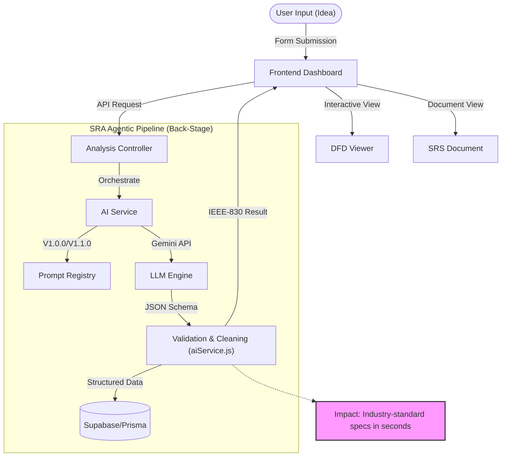

# System Architecture Overview

**Type:** Architecture Diagram
**Last Updated:** 2026-01-30
**Related Files:**
- `backend/src/services/aiService.js`
- `frontend/app/page.tsx`
- `backend/src/controllers/analysisController.js`

## Purpose

Maps the end-to-end flow from raw user input to professional SRS generation, highlighting the AI governance and validation layers.

## Diagram

## Key Insights

- **Front-Stage**: Interactive dashboard allowing rapid iteration on project ideas.
- **Back-Stage**: Decoupled prompt registry allowing versioning (V1.0.0, V1.1.0) without service downtime.
- **Impact**: Transformation of informal prose into structured, verifiable technical requirements (IEEE-830).

## Change History

- **2026-01-30:** Initial architectural map created during codebase elevation.
