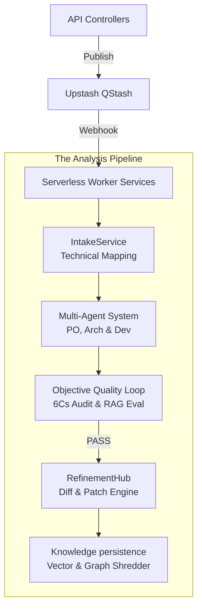

# SRA Backend: 5-Layer Analysis Engine


The SRA Backend is a high-performance Express.js ecosystem powered by Google Gemini, designed to orchestrate the transition from raw project intent to validated IEEE-830 requirements.

## 🏗️ 5-Layer Service Architecture

Our core logic is partitioned into five distinct service layers for maximum reliability and scalability.



### 1. **IntakeService** (Technical Mapping)
Translates unstructured text into the `SRSIntakeModel` with strict schema validation.

### 2. **Multi-Agent System** (MAS Analysis)
Orchestrates specialized AI roles (Product Owner, Architect, Lead Developer) using the **v1.1.0 Gold Standard** prompt registry for consistent IEEE-830 output.

### 3. **Objective Quality Loop** (Audit & Benchmarking)
Gates output via automated auditing:
- **Critic Agent**: Real-time scoring against the **6Cs** of Requirements Quality.
- **Evaluation Service**: Benchmarking **Faithfulness** and **Relevancy** via RAGAS-style metrics.

### 4. **RefinementHub** (Contextual Patching)
Handles incremental updates via the Workspace UI, injecting existing project state into refinement prompts.

### 5. **KnowledgeBaseService** (Persistence & Graph)
Shreds finalized requirements into **PostgreSQL + pgvector** and extracts semantic relationships into the **Knowledge Graph**.

## 🛠️ Performance & Reliability

### Background Processing
-   **Upstash QStash**: Serverless async messaging for scalable AI operations.
-   **Atomic Responses**: Users receive immediate "Analysis Started" responses, with progress updates delivered via subsequent polling.

### AI Robustness
-   **Dynamic Provider Switching**: Abstraction layer supports Gemini 2.5 and OpenAI GPT-4o.
-   **Error Backoff**: Automated exponential backoff for 429 (Rate Limit) and 5xx (AI Downtime) errors.

## 📂 Architecture

### Key Files

| Path | Purpose |
|------|---------|
| `src/app.js` | Express app configuration and middleware setup. |
| `src/controllers/analysisController.js` | Main entry point for starting analysis and handling refinements. |
| `src/services/geminiService.js` | Wrapper for Google Gemini API interactions. |
| `src/workers/analysisWorker.js` | Background worker that executes the heavy AI analysis tasks. |
| `prisma/schema.prisma` | Database schema definition (PostgreSQL). |

### Dependencies

-   **Upstream**: None (Entry point for the system).
-   **Downstream**:
    -   **PostgreSQL**: Persistence for Users, Projects, and Analysis history.
    -   **Upstash QStash**: Async task queue for reliable long-running processes.
    -   **Google Gemini**: Intelligence provider for all requirement generation.

## 🚀 Setup & Deployment

### Prerequisites
-   Node.js (v20+) & npm
-   PostgreSQL (Database)
-   Upstash QStash (Serverless Queue)
-   Gemini API Key

### Installation

1.  **Install Dependencies**:
    ```bash
    npm install
    ```

2.  **Environment Configuration**:
    Configure `.env` (see `.env.example`).
    **Crucial**: Generate a secure `JWT_SECRET` for production:
    ```bash
    openssl rand -base64 32
    ```

3.  **Database Migration**:
    ```bash
    npx prisma migrate dev
    ```

4.  **Start Server**:
    ```bash
    npm run dev
    ```

## 🔒 Security Features

### Authentication
The backend uses JWT (JSON Web Tokens) for stateless authentication.
- **JWT**: Tokens are issued upon successful login/signup and must be included in the `Authorization: Bearer <token>` header for protected routes.
- **Security**: Mandatory `JWT_SECRET` validation in production.

### Content Security Policy (CSP)
We use `helmet` to enforce a strict CSP.
- **Default Policy**: Strict `script-src: ["'self'"]` is enforced by default.
- **Local Dev Note**: While Next.js dev tools may trigger `unsafe-eval` warnings in the browser console, the server maintains its strict policy for maximum security.

## 🔧 Troubleshooting

### Common Issues

**`429 Too Many Requests` (AI)**
-   **Cause**: You have hit the rate limit for the Google Gemini API.
-   **Fix**: Wait a minute and retry. The system has built-in backoff, but frequent retries may still be blocked.

**Analysis Stuck in `PENDING`**
-   **Cause**: The QStash webhook is not reaching your local machine.
-   **Fix**: Ensure your local server is exposed to the internet (e.g., using ngrok) or you are testing in a cloud environment where QStash can reach the `ANALYZER_URL`.

**Prisma Connection Error**
-   **Cause**: Incorrect `DATABASE_URL`.
-   **Fix**: Check your `.env` file and ensure the Supabase connection string is correct. Note that Prisma 7 migration commands require `DIRECT_URL` to be configured in your `.env`.

## 🔗 Key API Domains

| Domain | Controller | Description |
| :--- | :--- | :--- |
| **Auth** | `authController` | JWT, Google/GitHub OAuth, Session Mgmt |
| **Analysis** | `analysisController` | Layer 1-3 creation and Layer 4 refinements |
| **Knowledge** | `knowledgeController` | Layer 5 finalization and reuse queries |

## 🧪 Integration Testing

We maintain high coverage of the analysis layers via specialized integration scripts:

-   `test-layer1-integration.js`: Verifies intake structured mapping.
-   `test-validation-integration.js`: Benchmarks the AI gatekeeper accuracy.
-   `test-layer5-integration.js`: Confirms Knowledge Base shredding and hash-reuse consistency.
