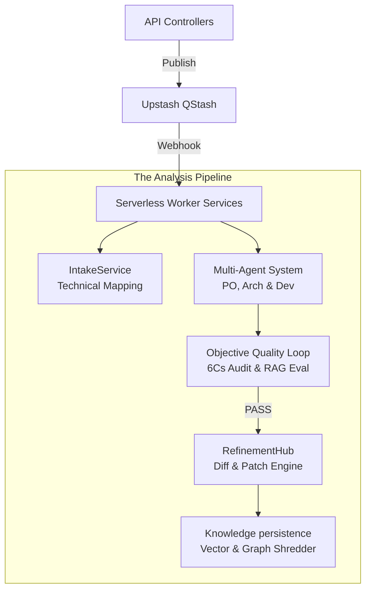

# SRA Backend: 5-Layer Analysis Engine


The SRA Backend is a high-performance Express.js ecosystem that orchestrates the transition from raw project intent to a validated requirements specification — in IEEE 830, ISO/IEC/IEEE 29148, Volere or Agile PRD form.

Generation is **bring-your-own-key on every provider** (Gemini, OpenAI, Claude, Grok) with no platform-funded fallback; the platform's own Gemini key funds embeddings only, because the `vector(768)` pgvector columns are a single shared embedding space that cannot be per-user.

## 🏗️ 5-Layer Service Architecture

Our core logic is partitioned into five distinct service layers for maximum reliability and scalability.


```mermaid
graph TD
    A[API Controllers] -->|Publish| Q[Upstash QStash]
    Q -->|Webhook| W[Serverless Worker Services]

    subgraph "The Analysis Pipeline"
        W --> L1[IntakeService<br/>Technical Mapping]
        W --> L2[Multi-Agent System<br/>PO, Arch & Dev]
        L2 --> L3[Objective Quality Loop<br/>6Cs Audit & RAG Eval]
        L3 -->|PASS| L4[RefinementHub<br/>Diff & Patch Engine]
        L4 --> L5[Knowledge persistence<br/>Vector & Graph Shredder]
    end
```

### 1. **IntakeService** (Technical Mapping)
Translates unstructured text into the `SRSIntakeModel` with strict schema validation.

### 2. **Multi-Agent System** (MAS Analysis)
Orchestrates specialized AI roles (Product Owner, Architect, Lead Developer) using the **v2.1.0 Gold Standard** prompt registry for consistent IEEE-830 output.

### 3. **Objective Quality Loop** (Audit & Benchmarking)
Gates output via automated auditing:
- **Critic Agent**: Real-time scoring against the **6Cs** of Requirements Quality.
- **Evaluation Service**: Benchmarking **Faithfulness** and **Relevancy** via RAGAS-style metrics.

### 4. **RefinementHub** (Contextual Patching)
Handles incremental updates via the Workspace UI, injecting existing project state into refinement prompts.

### 5. **KnowledgeBaseService** (Persistence & Graph)
Shreds finalized requirements into **PostgreSQL + pgvector** and extracts semantic relationships into the **Knowledge Graph**.

---

## 🛠️ CLI & Local Environment Sync
The backend supports bi-directional synchronization with the **SRA CLI**:
- **Format Discovery**: `GET /api/formats` and `GET /api/formats/:id` expose the format registry (unauthenticated — it is static, non-sensitive metadata already shipped in the public frontend bundle), so the CLI round-trips a document using the platform's own section definitions instead of assuming IEEE's.
- **Verification Metadata**: `updateAnalysis` accepts `verification_files`/`status` patched onto feature-shaped sections, plus the format-independent `metadata.cliTraceability` record that the web workspace renders for **every** format.
- **Writable Section Whitelist**: derived from the format registry (`listAllSectionIds()`), not hand-listed — hand-listing it meant edits to Volere/ISO/Agile sections were silently stripped by validation.
- **Data Integrity**: `inPlace` updates merge rather than replace, and a verification push sets `skipAlignment` so it does not pay for an LLM alignment check it cannot affect.

## 🛠️ Performance & Reliability

### Background Processing
-   **Upstash QStash**: Serverless async messaging for scalable AI operations.
-   **Stage Chaining**: The pipeline checkpoints after every stage and runs against a time budget. An invocation approaching the serverless ceiling persists its progress and re-enqueues itself, so a long run continues across invocations instead of being truncated (`services/pipelineBudget.js`).
-   **Live Progress**: Stage events publish to Redis pub/sub and stream to clients over SSE (`GET /api/analyze/:id/stream`); the browser is never required for the run to finish.
-   **Reconciliation**: A scheduled sweep fails out runs stuck `IN_PROGRESS` past a safe threshold and prunes stale drafts.

### AI Robustness
-   **Multi-Provider Adapters**: One interface over Gemini, OpenAI, Claude and Grok (`services/providers/`). Every generation call runs on the user's own key.
-   **Fail Loudly on Truncation**: A `MAX_TOKENS`/`length` finish reason raises at the adapter boundary rather than being "repaired" into a valid-but-shorter document that would pass schema validation and be scored as complete.
-   **Budgets Sized to the Model**: Output ceilings discovered per model with the key drive generation budgets, instead of one fixed constant that truncates small models and wastes headroom on large ones.
-   **Error Backoff**: Jittered exponential backoff on 429/5xx, honouring the provider's own `RetryInfo`; an exhausted daily quota fails fast instead of burning the invocation on doomed retries.

## 📂 Architecture

### Key Files

| Path | Purpose |
|------|---------|
| `src/app.js` | Express app configuration, middleware order and route mounting. |
| `src/controllers/analysisController.js` | Entry point for starting analyses and handling refinements. |
| `src/services/analysisService.js` | The pipeline orchestrator — read this to understand the whole flow. |
| `src/services/providers/` | Per-provider adapters + the BYOK key/model resolver. |
| `src/formats/` | Format descriptors driving generation, schema, prompts and the writable-key whitelist. |
| `src/agents/BaseAgent.js` | Shared retry, timeout, token-budget and JSON-repair layer for all agents. |
| `src/controllers/workerController.js` | QStash callback target; handles continuations and duplicate deliveries. |
| `prisma/schema.prisma` | Database schema definition (PostgreSQL + pgvector). |

### Dependencies

-   **Upstream**: None (Entry point for the system).
-   **Downstream**:
    -   **PostgreSQL**: Persistence for Users, Projects, and Analysis history.
    -   **Upstash QStash**: Async task queue for reliable long-running processes.
    -   **Google Gemini**: Intelligence provider for all requirement generation.

## 🚀 Setup & Deployment

### Prerequisites
-   Node.js (>=20.19.0) & pnpm
-   PostgreSQL (Database)
-   Upstash QStash (Serverless Queue)
-   Gemini API Key

### Installation

1.  **Install Dependencies**:
    From the monorepo root:
    ```bash
    pnpm install
    ```

2.  **Environment Configuration**:
    Configure `backend/.env` (see `backend/.env.example`).
    **Crucial**: Generate a secure `JWT_SECRET` for production:
    ```bash
    openssl rand -base64 32
    ```

3.  **Database Migration**:
    From the monorepo root:
    ```bash
    pnpm --filter backend exec prisma migrate dev
    ```
    Or inside the `backend/` directory:
    ```bash
    pnpm prisma migrate dev
    ```

4.  **Start Server**:
    From the monorepo root:
    ```bash
    pnpm dev:backend
    ```
    Or inside the `backend/` directory:
    ```bash
    pnpm run dev
    ```

## 🔒 Security Features

### Authentication
Two credential types share one `Authorization: Bearer <token>` header, distinguished by prefix in `middleware/authMiddleware.js`:
- **JWT**: issued on login/signup for browser sessions. Mandatory `JWT_SECRET` validation in production.
- **API keys** (`sra_live_…`): long-lived credentials for the CLI and CI, created via `POST /api/auth/keys`. The plaintext key is returned once as `rawKey`; only a SHA-256 hash is stored.

### Content Security Policy (CSP)
We use `helmet` to enforce a strict CSP.
- **Default Policy**: Strict `script-src: ["'self'"]` is enforced by default.
- **Local Dev Note**: While Next.js dev tools may trigger `unsafe-eval` warnings in the browser console, the server maintains its strict policy for maximum security.

## 🔧 Troubleshooting

### Common Issues

**`429 Too Many Requests` (AI)**
-   **Cause**: You have hit the rate limit for the Google Gemini API.
-   **Fix**: Wait a minute and retry. The system has built-in backoff, but frequent retries may still be blocked.

**Analysis Stuck in `PENDING`**
-   **Cause**: The QStash webhook is not reaching your local machine.
-   **Fix**: Ensure your local server is exposed to the internet (e.g., using ngrok) or you are testing in a cloud environment where QStash can reach the `ANALYZER_URL`.

**Prisma Connection Error**
-   **Cause**: Incorrect `DATABASE_URL`.
-   **Fix**: Check your `.env` file and ensure the Supabase connection string is correct. Note that Prisma 7 migration commands require `DIRECT_URL` to be configured in your `.env`.

## 🔗 Key API Domains

| Domain | Controller | Description |
| :--- | :--- | :--- |
| **Auth** | `authController` | JWT, Google/GitHub OAuth, Session Mgmt |
| **Analysis** | `analysisController` | Layer 1-3 creation and Layer 4 refinements |
| **Knowledge** | `knowledgeController` | Layer 5 finalization and reuse queries |

## 🧪 Integration Testing

We maintain high coverage of the analysis layers via specialized integration scripts:

-   `test-layer1-integration.js`: Verifies intake structured mapping.
-   `test-validation-integration.js`: Benchmarks the AI gatekeeper accuracy.
-   `test-layer5-integration.js`: Confirms Knowledge Base shredding and hash-reuse consistency.
