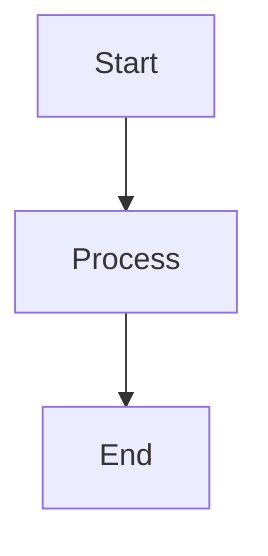
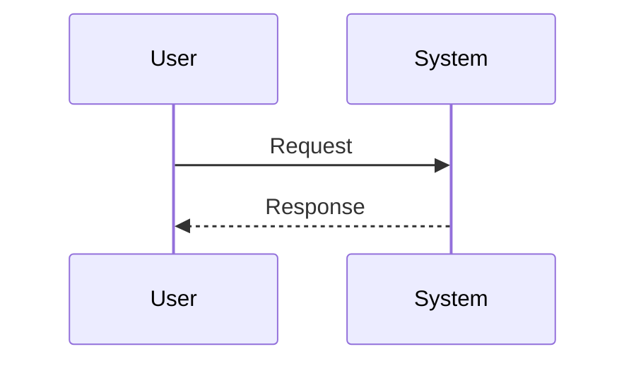
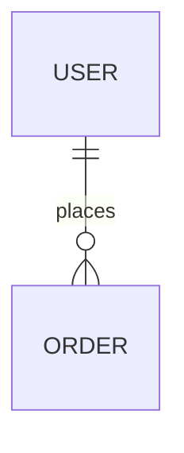

# Golden Title
**Specification Standard:** IEEE 830-1998 (IEEE830)  
**Document Type:** Software Requirements Specification  
**Generated by:** SRA (Smart Requirements Analyzer)  
**Date:** 2026-09-14  

---

## 1. Introduction

### 1.1 Purpose
Provide a secure payment processing infrastructure.

### 1.2 Document Conventions
IEEE 830-1998 standard conventions.

### 1.3 Intended Audience and Reading Suggestions
Engineering, QA, and compliance stakeholders.

### 1.4 Product Scope
*None specified.*

### 1.5 References
- IEEE Std 830-1998
- PCI DSS v4.0

## 2. Overall Description

### 2.1 Product Perspective
A standalone payment microservice.

### 2.2 Product Functions
- Authorize card
- Capture funds
- Issue refund

### 2.3 User Classes and Characteristics
- **Merchant Admin:** Configures payment methods.
- **Support Agent:** Investigates failed transactions.

### 2.4 Operating Environment
*None specified.*

### 2.5 Design and Implementation Constraints
*None specified.*

### 2.6 User Documentation
- API reference

### 2.7 Assumptions and Dependencies
- Assumes a reachable card network gateway.

## 3. External Interface Requirements

### 3.1 User Interfaces
None — this is a backend service.

### 3.2 Hardware Interfaces
*None specified.*

### 3.3 Software Interfaces
REST API over HTTPS.

### 3.4 Communications Interfaces
TLS 1.3.

## 4. System Features

### 4.1 Credit Card Processing
Processes Visa and Mastercard transactions.

#### Stimulus-Response Sequences
- User submits card details
- System returns authorization result

#### Functional Requirements
- **FR-1.1:** The system shall validate the 16-digit card number using the Luhn algorithm.
- **FR-CUSTOM-1:** The system shall verify CVV with the card issuing network.
  - *Rationale:* Reduces card-not-present fraud.
  - *Fit Criterion:* 99.9% of invalid CVVs rejected in under 500ms.
  - *Verification:* Test
  - *Source:* PCI DSS 3.2

### 4.2 Empty Feature
## 5. Other Nonfunctional Requirements

### 5.1 Performance Requirements
- 95th percentile latency under 200ms.

### 5.2 Safety Requirements
*None specified.*

### 5.3 Security Requirements
- All card data encrypted at rest with AES-256.

### 5.4 Software Quality Attributes
- Availability: 99.95% monthly uptime.

### 5.5 Business Rules
*None specified.*

## 6. Other Requirements

- Must support PCI DSS re-certification annually.

## Appendix A: Glossary

- **PAN:** Primary Account Number
- **CVV:** Card Verification Value

## Appendix B: Analysis Models

### System Architecture Flowchart

### Sequence Model

### Entity Relationship Model

