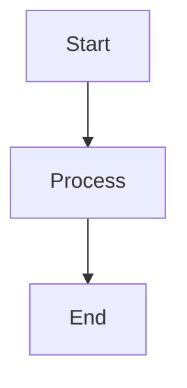
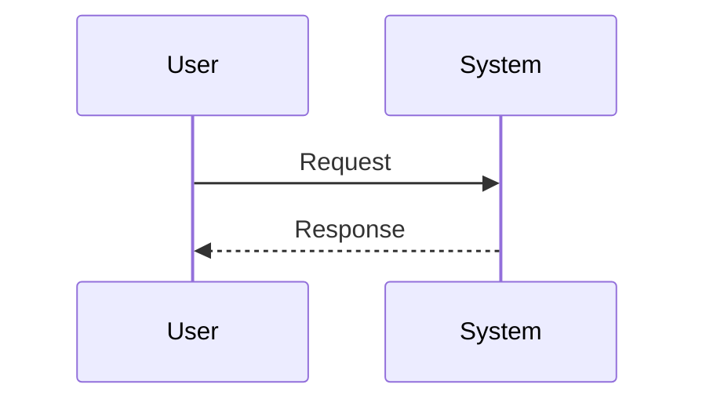
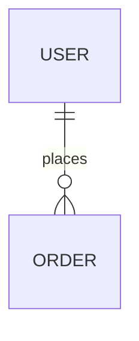

# Golden Title
**Specification Standard:** ISO/IEC/IEEE 29148:2018 (ISO29148)  
**Document Type:** System/Software Requirements Specification  
**Generated by:** SRA (Smart Requirements Analyzer)  
**Date:** 2026-09-14  

---

## 1. Introduction

### 1.1 Purpose
Collect and analyze vehicle telemetry in real time.

### 1.2 Scope
Covers ingestion, storage, and dashboarding.

### 1.3 Product Perspective
A cloud-native streaming pipeline.

### 1.4 Product Functions
- Ingest telemetry
- Detect anomalies

### 1.5 User Characteristics
- **Fleet Operator:** Monitors live vehicle status.

### 1.6 Limitations and Constraints
- Must run within existing AWS account.

### 1.7 Assumptions and Dependencies
*None specified.*

## 2. References

- ISO/IEC/IEEE 29148:2018

## 3. External Interfaces

### 3.1 User Interfaces
Web dashboard.

### 3.2 Hardware Interfaces
OBD-II telemetry units.

### 3.3 Software Interfaces
Kafka ingestion topic.

### 3.4 Communications Interfaces
MQTT over TLS.

## 4. System Functions

### 4.1 Anomaly Detection
Flags telemetry outside expected ranges.

#### Functional Requirements
- **SF-1:** The system shall flag readings 3 standard deviations from the rolling mean.
  - *Verification:* Analysis

## 5. Software System Attributes

### 5.1 Performance Requirements
- Process 10k events/sec sustained.

### 5.2 Security
- mTLS between all internal services.

### 5.3 Safety
*None specified.*

### 5.4 Software Quality Attributes
*None specified.*

### 5.5 Business Rules
*None specified.*

## 6. Verification

Verified via load testing and anomaly-injection drills.

## Appendix A: Definitions

- **OBD-II:** On-board diagnostics standard.

## Appendix B: Analysis Models

### System Architecture Flowchart

### Sequence Model

### Entity Relationship Model

