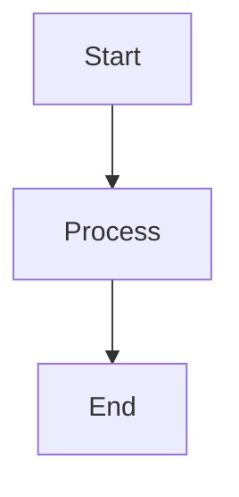
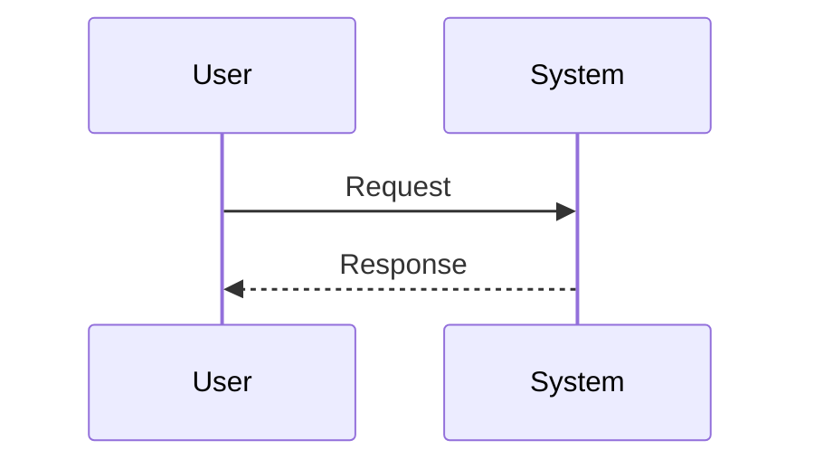
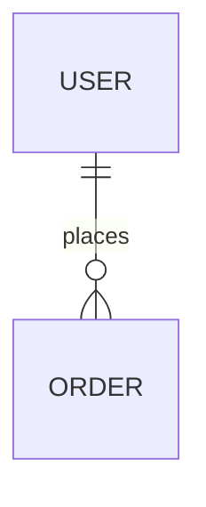

# Golden Title
**Specification Standard:** Volere (VOLERE)  
**Document Type:** Requirements Specification  
**Generated by:** SRA (Smart Requirements Analyzer)  
**Date:** 2026-09-14  

---

## 1. The Purpose of the Project

### 1.1 The Background of the Project Effort
Volunteer shifts are currently coordinated by spreadsheet.

### 1.2 Goals of the Project
- Reduce no-show rate
- Cut coordinator admin time by half

## 2. Stakeholders

- **Coordinator:** Fast shift assignment.
- **Volunteer:** Clear, timely shift reminders.

## 3. Constraints

### 3.1 Solution Constraints
- Must integrate with existing SMS provider.

### 3.2 Implementation Environment
Deployed on the org's existing hosting.

### 3.3 Assumptions
- Volunteers have a mobile phone capable of SMS.

## 4. Naming Conventions and Terminology

- **Shift:** A scheduled volunteer time block.

## 5. Functional Requirements

### 5.1 Shift Assignment
Assign volunteers to open shifts.

#### Functional Requirements
- **FR-1.1:** The system shall notify a volunteer within 5 minutes of assignment.
  - *Rationale:* Timely confirmation reduces no-shows.
  - *Fit Criterion:* 95% of notifications sent within 5 minutes.

## 6. Non-functional Requirements

### 6.1 Look and Feel Requirements
- **LOO-1:** The UI shall use the org's existing brand palette.

### 6.2 Usability and Humanity Requirements
- **USA-1:** A first-time coordinator shall complete shift setup within 10 minutes unaided.
  - *Fit Criterion:* 90% success rate in usability testing.

### 6.3 Performance Requirements

### 6.4 Operational and Environmental Requirements
- **OPE-1:** The system shall run on commodity hosting with no dedicated ops staff.

### 6.5 Maintainability and Support Requirements

### 6.6 Security Requirements
- **SEC-1:** Volunteer phone numbers shall be encrypted at rest.

### 6.7 Cultural and Political Requirements

### 6.8 Legal Requirements
- **LEG-1:** Must comply with TCPA consent requirements for SMS.

## 7. Project Issues

- **SMS provider rate limits:** Could delay notifications during peak sign-up. *(Mitigation: Queue and backoff.)*

## Appendix A: Analysis Models

### System Architecture Flowchart

### Sequence Model

### Entity Relationship Model

